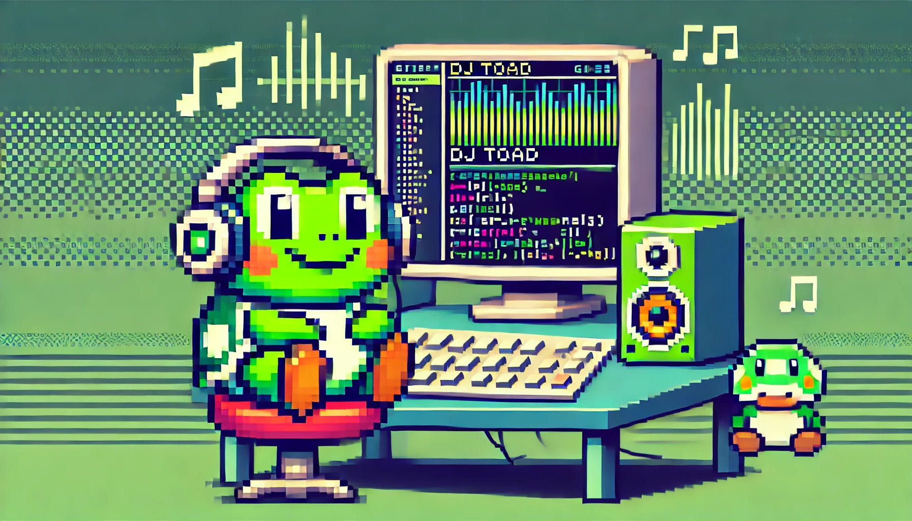

# DJ Toad (Deployed VPC via Railway.app) 🎧🐸



DJ Toad es un bot de Discord diseñado para reproducir música en tu servidor. Se integra con YouTube Music para buscar canciones y utiliza **yt-dlp** y **FFmpeg** para la reproducción de audio.

Este README describe cómo está implementado el proyecto y cómo desplegarlo en [Railway](https://railway.app/) utilizando un **Dockerfile**.

---

## Índice
1. [Características](#características)  
2. [Requisitos previos](#requisitos-previos)  
3. [Estructura de archivos](#estructura-de-archivos)  
4. [Instrucciones de despliegue en Railway](#instrucciones-de-despliegue-en-railway)  
5. [Variables de entorno](#variables-de-entorno)  
6. [Uso del bot en Discord](#uso-del-bot-en-discord)  
7. [Notas sobre cookies](#notas-sobre-cookies)  
8. [Comandos disponibles](#comandos-disponibles)  
9. [Créditos y licencias](#créditos-y-licencias)

---

## Características

- **Búsqueda y reproducción** de canciones desde YouTube Music.  
- **Cola de reproducción** dinámica y sencilla de gestionar.  
- **Control total**: Comandos para pausar, reanudar, saltar y detener la música.  
- **Recomendaciones automáticas**: Obtiene más canciones sugeridas para no quedarte sin música.  
- **Soporte para cookies**: Permite usar un archivo `cookies.txt` para sortear restricciones de YouTube (p. ej. “Sign in to confirm you're not a bot”).

---

## Requisitos previos

1. **Docker** instalado (si deseas construir la imagen localmente).  
2. **Cuenta de Railway** para el despliegue en la plataforma.  
3. **Cuenta de Discord** con privilegios para invitar bots a tu servidor.  
4. (Opcional) **Archivo `cookies.txt`** con cookies de YouTube, si en tu país o tus canciones favoritas YouTube exige iniciar sesión para reproducirlas.  
5. **Token de Discord** (lo obtendrás en el [Portal de Desarrolladores de Discord](https://discord.com/developers/applications)).

---

## Estructura de archivos

Algunos de los archivos principales de este repositorio:

```bash
.
├─ Dockerfile                # Define la imagen Docker con Python y FFmpeg
├─ requirements.txt          # Dependencias de Python (incluye ytmusicapi, yt-dlp, discord.py, etc.)
├─ djtoad_railway.0.1.py     # Archivo principal del bot
├─ cookies.txt               # Archivo de cookies de YouTube (opcional, si lo usas)
├─ README.md                 # Este README
├─ djtoad.jpg                # Imagen/logo del bot
└─ ... (otros archivos de interés)
```
---

## Instrucciones de despliegue en Railway

1. **Clona** este repositorio en tu cuenta de GitHub (o tenlo ya en un repo propio).  
2. **Crea un nuevo proyecto** en [Railway](https://railway.app/).  
3. **Conéctalo** a tu repositorio de GitHub donde está DJ Toad.  
4. Una vez conectado, Railway detectará el Dockerfile. Asegúrate de que el build log muestre que se instala `ffmpeg`, `ytmusicapi`, etc.  
5. **Configura las variables de entorno** en Railway (ver sección [Variables de entorno](#variables-de-entorno)).  
6. **Inicia el despliegue**. Railway construirá la imagen Docker y la pondrá a correr.  
   - En la consola de logs de Railway podrás ver si ha arrancado con éxito.  
   - Deberías ver un mensaje del estilo:
     ```php
     ✅ Tu rana favorita conectada como <nombre_de_bot>
     ```
7. **Invita el bot** a tu servidor de Discord:
   - En el [Portal de Desarrolladores de Discord](https://discord.com/developers/applications), entra a tu aplicación/bot y busca la sección **OAuth2 > URL Generator**.
   - Selecciona `bot` en **Scopes** y marca los permisos necesarios:
     - Connect, Speak, Send Messages, etc.
   - Abre la URL generada en tu navegador y elige el servidor al que quieras invitar el bot.
8. **Listo**. Tu bot estará funcionando en Railway. Cada vez que hagas un push a la rama principal (o la rama configurada) y se produzca un despliegue, se actualizará el bot.

---

## Variables de entorno

Asegúrate de definir en Railway (o en tu `.env` local) al menos:

| Variable        | Descripción                                                                 |
|-----------------|-----------------------------------------------------------------------------|
| `DISCORD_TOKEN` | El token de tu bot de Discord, obtenido desde el Dev Portal.                 |

**Cómo agregar la variable en Railway**:
1. En tu panel de Railway, ve a la sección **Variables** del proyecto.
2. Añade `DISCORD_TOKEN` como clave y el valor será tu token de Discord.
3. (Si necesitases más variables, por ejemplo para otras claves, simplemente añádelas de la misma forma.)

---

## Uso del bot en Discord

1. **Únete** a un canal de voz en tu servidor de Discord.  
2. En un canal de texto, escribe alguno de los comandos listados abajo.  
3. El bot se conectará a tu canal de voz y comenzará la reproducción.

---

## Notas sobre cookies

- Si YouTube pide “Sign in to confirm you’re not a bot” o hay contenido bloqueado, necesitarás un **archivo `cookies.txt`** con tu sesión de YouTube.  
- Para generarlo, exporta tus cookies del navegador (Chrome/Firefox) con la sesión iniciada en YouTube. Existen extensiones como “Get Cookies.txt” que facilitan esto.  
- Coloca el archivo `cookies.txt` en la **misma carpeta** que `djtoad_railway.0.1.py`.  
- En el código, `yt-dlp` usará `'cookiefile': 'cookies.txt'` para acceder a YouTube como si fueras tú.  
- **No compartas** públicamente tu `cookies.txt`; equivale a tener acceso a tu cuenta de Google.

---

## Comandos disponibles

- **`!play [texto]`**  
  Busca y reproduce la canción indicada.  
  *Ejemplo:* `!play Nirvana Smells Like Teen Spirit`

- **`!add [texto]`**  
  Añade la canción buscada al **inicio** de la cola.

- **`!list`**  
  Muestra la canción actual y las siguientes en la cola.

- **`!next`**  
  Salta a la siguiente canción en la cola.

- **`!pause`**  
  Pausa la canción en reproducción.

- **`!resume`**  
  Reanuda la canción pausada.

- **`!stop`**  
  Detiene la música y el bot se desconecta del canal de voz.

- **`!dance1`, `!dance2`**  
  Envía un GIF de baile en el canal de texto.

---

## Créditos y licencias

- **Discord.py**: Librería para interactuar con la API de Discord.  
- **ytmusicapi**: Para buscar y manejar información musical de YouTube Music.  
- **yt-dlp**: Para extraer y descargar la pista de audio de YouTube.  
- **FFmpeg**: Necesario para la reproducción de audio en Discord.

**Autor**:  
- Nombre: Victor Belinchón  
- Contacto: [vbelinchonperez@gmail.com](mailto:vbelinchonperez@gmail.com)

Este proyecto está bajo la **Licencia MIT**. Consulta el archivo `LICENSE` para más detalles.
